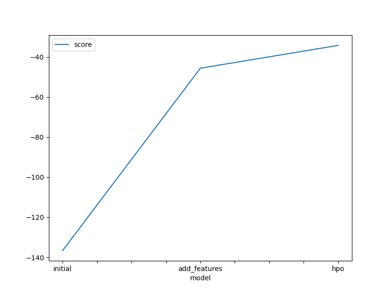
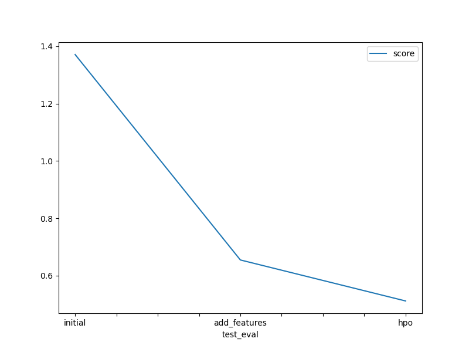

# Report: Predict Bike Sharing Demand with AutoGluon Solution
#### BAŞAK DİLARA ÇEVİK

## Initial Training
### What did you realize when you tried to submit your predictions? What changes were needed to the output of the predictor to submit your results?
Upon attempting to submit predictions, the crucial realization was the necessity to align the prediction outputs with the sampleSubmission format, assigning predictions to specific datetimes for relevance.

The top-performing model was the WeightedEnsemble_L3, boasting a score_val of -34.230408 and a Kaggle score of 0.51188.

### What was the top ranked model that performed?
It was the WeightedEnsemble_L3 with score_val of -34.230408 and kaggle score of 0.51188 .

## Exploratory data analysis and feature creation
### What did the exploratory analysis find and how did you add additional features?
The exploratory analysis, beyond the rubric requirements, involved examining the minimum, maximum, and standard deviation using describe() and scrutinizing the count histogram. Although no significant revelations emerged, it became evident that the distinction between weekdays and weekends could significantly influence bike sharing. Thus, I created weekend features leveraging datetime information. Post-project completion, I realized the presence of a "working day" feature, rendering my addition somewhat redundant.

### How much better did your model preform after adding additional features and why do you think that is?
The model exhibited notable improvement post the inclusion of additional features. This enhancement can be attributed to the fact that while individual features might not directly explain the target, their combination with other features can establish correlations. For instance, hot weather alone might not affect bike sharing demand significantly, but when coupled with high humidity, it can lead to reduced demand.

## Hyper parameter tuning
### How much better did your model preform after trying different hyper parameters?
After experimenting with various hyperparameters, the model exhibited only marginal improvement. Given more expertise and time, significant enhancements could have been achieved.

### If you were given more time with this dataset, where do you think you would spend more time?
Given more time with this dataset, I would have delved deeper into exploring different hyperparameters and fine-tuning strategies. Additionally, I would aim to introduce more features and strive to surpass my Kaggle score.

### Create a table with the models you ran, the hyperparameters modified, and the kaggle score.
| Model        | Hyperparameters   |   Score |
|:-------------|:------------------|--------:|
| initial      | `hyperparameter_tune_kwargs= {'eval_metric': 'root_mean_squared_error'}` | 1.37086 |
| add_features | `hyperparameter_tune_kwargs= {'eval_metric': 'root_mean_squared_error'}` | 0.65481 |
| hpo          | `hyperparameter_tune_kwargs= {'eval_metric': 'root_mean_squared_error', 'num_trials': 50, 'search_strategy': 'grid', 'search_options': {'opt_skip_init_length': 10}, 'scheduler': 'local', 'searcher': 'auto'}, hyperparameters= { 'CAT': [{}, {'depth': 6, 'learning_rate': 0.05, 'max_ctr_complexity': 4}, {'depth': 8, 'grow_policy': 'Depthwise', 'learning_rate': 0.04, 'max_ctr_complexity': 2}], 'XGB': [{}, {'enable_categorical': False, 'learning_rate': 0.02, 'max_depth': 10, 'min_child_weight': 0.5}, {'enable_categorical': False, 'learning_rate': 0.08, 'max_depth': 5, 'min_child_weight': 0.5}], 'FASTAI': [{}, {'bs': 256, 'emb_drop': 0.5, 'epochs': 45, 'layers': [800, 400], 'lr': 0.015}, {'bs': 2048, 'emb_drop': 0.05, 'epochs': 30, 'layers': [200, 100], 'lr': 0.09}]}] | 0.51188 |

### Create a line plot showing the top model score for the three (or more) training runs during the project.

### Create a line plot showing the top kaggle score for the three (or more) prediction submissions during the project.

## Summary

The project involved several critical stages, starting from initial training to exploratory analysis and hyperparameter tuning. 

* I utilized the Kaggle CLI with my API token to download and unzip the Bike Sharing Demand dataset into Sagemaker Studio, loading all datasets into Pandas DataFrames for analysis.

* I engineered new features from existing columns, visualized feature distributions with histograms, and optimized datatypes for a better analysis.

* Utilizing AutoGluon's TabularPredictor, I trained models on the dataset, adjusted hyperparameters, and made predictions on test data.

Notable improvements were observed post the addition of new features, underscoring the importance of feature engineering. While hyperparameter tuning yielded marginal gains, further exploration could potentially unlock significant performance improvements. The project's iterative nature, evidenced by the comparison of model training and Kaggle scores, highlights the iterative nature of model development and the pursuit of optimal performance. It was a very educational project. I learned the basics of AutoGluon and found it very useful.
